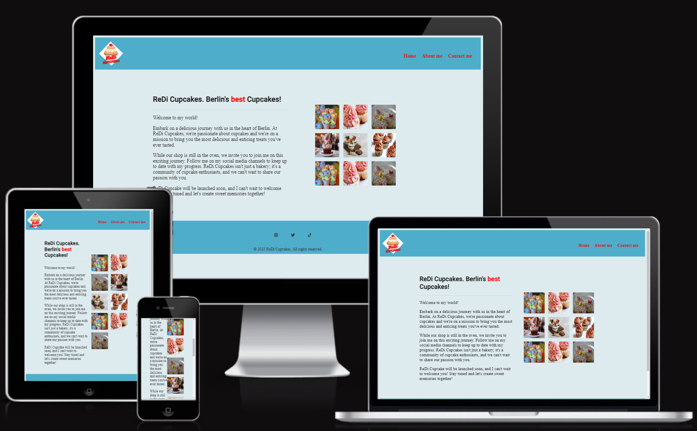

# ReDi Cupcakes

A website for selling muffins of ReDi School - For training purposes (in training).

## Description
This is my first project named "ReDi Cupcakes" from the ReDi School of Digital Integration's **Full-Stack MERN Bootcamp** (Fall, 2023).
It consists of a very simple web page created with **HTML5 and CSS3** for learning purposes.

## Features

### Existing Features

-   __Header__
	- The header is featured at the top of the page and includes a logo and navigation links.
	-  The logo is placed in the left corner and a menu is placed in the right corner.
	-  The logo image is a .png file and was designed by me with https://www.canva.com/. When the logo is clicked on it will take the user to the home page.
    - The navigation links include a Home page, About and Contact links which are responsive on multiple screen sizes. 

-   __Homepage__
    - This "home" section has a white blue background color HEX #CEE2E, and shows two divisions inside: one with the description of this webpage, and the other with 9 cupcake photos in a CSS grid, referring to the project idea. 
    - On this section is a div with a h1 with the name of the cupcake project, and 3 paragraphs that show about the content. The second div shows the cupcake pictures, which were styled in CSS, that "adapts" in different screen sizes. 
    - The picture was taken from the free Copyright data bank of https://www.freepik.com/, in .jpeg format.

- __About__   
	- The "about" section shows the idealizer (me) of this idea, and the reasons why the cupcakes were chosen. The sentences bring to the user a "humanized" feeling when reading them. 
	 - Same as the home page, this about page show 2 divs, in which the first one shows a h1 which the name of the page and 3 other paragraphs. The second div shows a picture of me in a funny position.

-   __Contact__
    - This third section has a contact form with a "Submit" button.
    - The fields are displayed in a different color than the background of the page to give the user a different feeling when writing feedback.

- __Footer__
    - The footer is featured underneath the whole website and contains an unordered inline list, with four social media icons (Instagram, Twitter and TikTok), which were linked with my personal social media pages. 
    -  The same color of the header was used here in order to order the website in its colors.
    - The social media icons were taken from Font Awesome icons and style with CSS. They are central positioned to offer to keep offering to the visitors a clear impression of the website.

## User Experience (UX)

Thinking of the user, the ReDi Cupcakes aims to presents a cupcake project which can be finished and started as soon the shop is done. It's a project in construction, in which can be developed turning am online shop of cupcakes in Berlin. 

-   #### First impressions of the users
	-  First, the tag line with the sentence "ReDi Cupcakes. Berlin's best Cupcakes!" is showing. It gives to the user the impression of a possible cupcake shop. 
	- As a first time visitor, I could immediately recognize that, it is a cupcake store in Berlin.
    - As a first time visitor, I could easily scroll the one-page website and navigate through its links, being in touch with its simple and objective content, which shows a cupcake project with social media contacts at the footer. 
    -  As a first time visitors, I could navigate throughout the site, regardless of screen size.

- __Features Left to Implement__

		- Sticky position of the Header/Menu.
		- A form submitted feature.
		- A shop page with all shop features.
		- Data base with its features.
		- Customer's profile creation form. 
		- Cupcakes own page with description of all cupcakes types.
		- Implementation of more completely and sophisticated pages.

## Design
- I have used different shadow of blue, using the ReDi blue as a principal color one. I kept the website clear in general. 
- For the text color I choose let as default because of the gray used in the head.

## Technologies Used

- HTML5
- CSS3
- [Google Fonts:](https://fonts.google.com/) To import font family ’Roboto’ into the style.css file which is used on all pages.
Added fallback font sans-serif.
- [Font Awesome:](https://fontawesome.com/) Was used in header and contact section to add icons for aesthetic and UX purposes.
- [GitHub:](https://github.com/) GitHub is used to store the projects code after being pushed from Git.
- [Git](https://git-scm.com/) Git was used for version control by utilizing the Gitpod terminal to commit to Git and Push to GitHub.
- [Freepik:](https://freepik.com/) Free Image Data Bank.
- [Am I Responsive:](http://ami.responsivedesign.is) Checking the responsive.
- [Coolors:](https://coolors.co/) Color pallet.

## Tests

### Browser testing

- The browsers I have used to test the page were Chrome, Brave and Microsoft Edge. The same functioning could be seen.
- The tests were done using Windows 10 and Windows 11 Pro and Android 14 device (Google Pixel 6).

### Responsiveness

- I have tested that this page works on different screen sizes from Samsung Galaxy S8+ (360px wide) and large screens like 4k.
- The Chrome developer tool have been used to check the responsiveness of the website. 

### Validator Testing 

For Markup Validator I have used the W3C Validator and for CSS, the W3C CSS Validator Services to validate all pages of the project to ensure there were no syntax errors in there. At the Markup Validator I found some warnings about the missing JavaScript code. The CSS Validator presented no errors.

- W3C Markup Validator (HTML)

- W3C CSS Validator

I have confirmed that the colors and fonts chosen are easy to read and accessible by running it through lighthouse in Chrome developer tools.

### Further Testing
- Navigation links on header: all works correctly.
- External links to the four social media channels: works correctly.
- I have tested that name, email and message is required to submit the form in the contact section.
- I have tested that the email input field must contain @ symbol to submit the form in the contact section.
- I have tested that the form submit button word "Submit" changes the color of the text when hovering over.

### Solved bugs
- The Home page section was not configured properly. So I have changed the CSS with, and it ran properly. 
- When testing on Brave browser using the developer tools, I realized that the Social Media icons were located to the left side and not centralized. I fixed this bug decreasing the padding.
- The logo was not sticky inside the head. I changed the position to fixed.

## Deployment
- The site was deployed to GitHub page, according to the steps:
  - Log in to GitHub > GitHub repository > first-portfolio-project.
  - "Settings" > "Pages" (on the left-hand menu).
  - Under "Source" > "Main" > "Root".
  - Click on "Save".

## Credits

- [Google Fonts:](https://fonts.google.com/) Font family ’Roboto’ used on all pages.
- [Font Awesome:](https://fontawesome.com/) Only used in fifth section to add icons at the style.
- [Am I Responsive:](http://ami.responsivedesign.is) Checking the responsive.

### Acknowledgements

- A huge thank to **ReDi School** in Berlin, to my colleagues at **Slack community** of the school, and to **my partner**, always very helpful to me.

